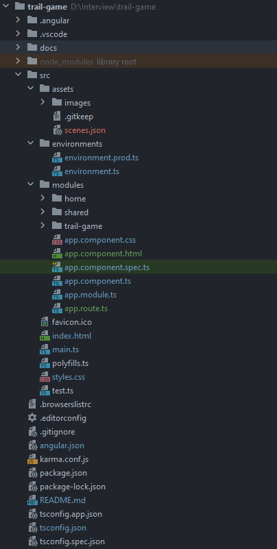
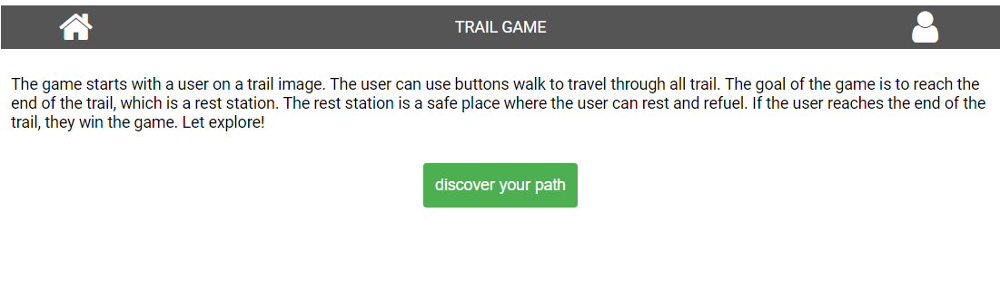
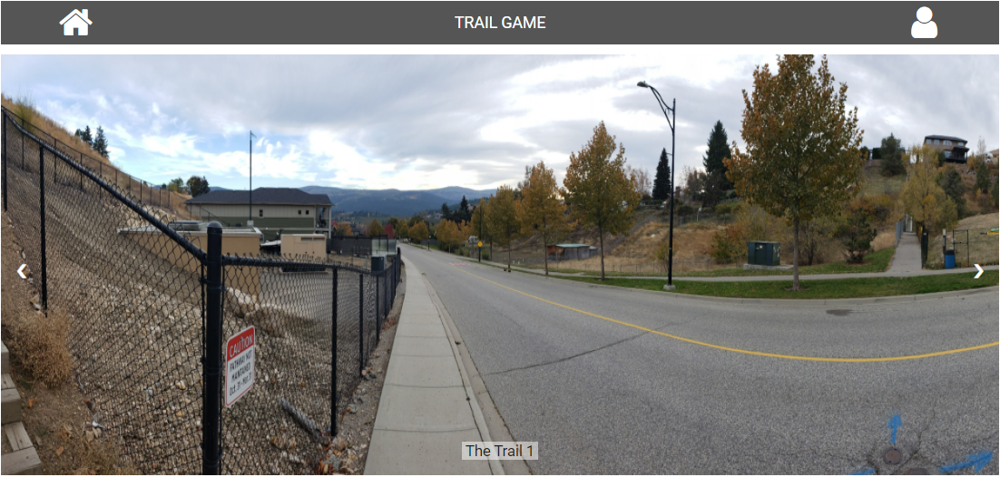
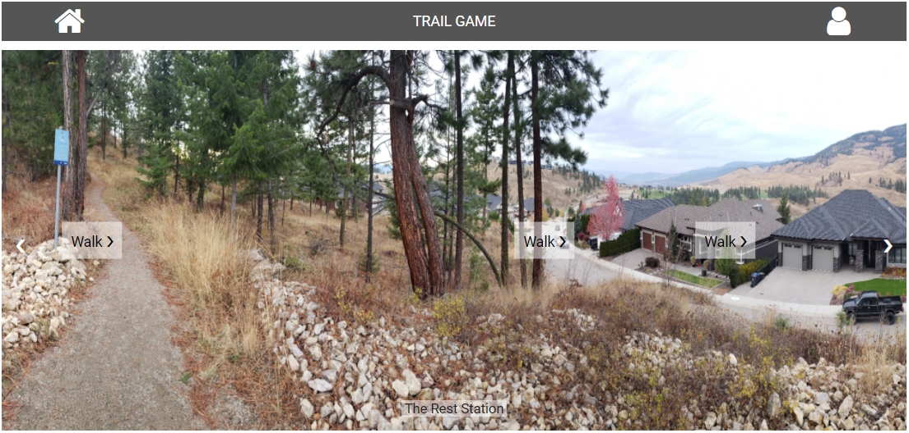

# Coding Challenge

## Goal
- Create a simple game where you are walking along a trail.
- You begin your adventure at the  bottom of the trail and you hike your way up to the top.
- If you turn around you are facing the  other direction.

## Requirements
### Git

- Commit to GitHub
- Use single-purpose commits
- Use [semantic commit messages](https://gist.github.com/joshbuchea/6f47e86d2510bce28f8e7f42ae84c716)


### Code

- Use your framework (React, Vue, or Angular)
- Use Typescript and strongly typed code
- For design use, Ionic Framework is a plus
- Unit test is a plus

### Structure

- All the images will be as a json file, you must determine the structure. For example you  may define it as
```json
  {
    “scenes”: [
      {
        “id”: 0, “background_url”: “mountain0.png”, “hitzones”: [
        {“x”: “10%”, “y”:”50%”, “goto”: 1}
      ]},
      {
        “id”: 1, “background_url”: “mountain1.png”, “hitzones”: [
        {“x”: “10%”, “y”:”50%”, “goto”: 0},
        {“x”: “60%”, “y”:”50%”, “goto”: 2}
      ]},
    ]
  }
```

### Report

- Record how many hours you spent on the project
- Record what you would improve on if you had more time.
- Include these in the README.md

### Assets

- Here are the [pictures](https://photos.app.goo.gl/ioPLWRSakbctgLkb8)

### Design

- Works on a phone (it is still a website but is mobile first)
-  Works as a desktop (responsive design)
- It has scroll left and right buttons that scroll the background image left or right.

- Has a button over the trail that if you press it you walk there. Like google street view  but simpler
  [example](https://www.google.ca/maps/@49.8741404,-119.3492443,3a,75y,105.46h,77.91t/data=!3m6!1e1!3m4!1sRhiWMCxfgWeF3VOkgJW3rA!2e0!7i13312!8i6656)

---

## TimeLine

> 11:04 10 thg 7, 2023

* receive mail about task 

---

> 13 th 07, 2023

* feat: create project structure (please see more details in result below)

* feat: implement home page

### Total: about 4 hours
### Result
#### Project structure.


```
.
+-- src
|   +-- assets
|   +-- environments
|   +-- modules
|       +-- <module a>
|           +-- <module a>.component.html
|           +-- <module a>.component.ts
|           +-- models
|           +-- services
|               +-- interfaces
|               +-- implements
|           +-- constants
|       +-- <module b>
|           +-- <module b>.component.html
|           +-- <module b>.component.ts
|       <parent module>.module.ts
|       <parent module>.module.ts
+-- index.html (Index file)
```
#### Structure description.
- ```assets``` : Static files (such as: ```*.css```, ```*.json```, ...) should be stored in this folder.
- ```environments```: Contains classes or variables that depend on build environment.
- ```modules```: Application main modules should be stored in this folder
- ```<module a>```: Folder contains module a definition. Such as : ```account```, ```category```, ...
- ```<module a>.component.html```: Template file for ```module a```.
- ```<module a>.component.ts```: Logic definition file of ```module a```.
- ```<parent module>.module.ts```: Importing/exporting children modules. For example: ```user-management```, ```category-management```.
- ```<parent module>.route.ts```: Child modules' routes definition.
- ```interfaces```: Contains application interfaces which is for classes to implement.
- ```models```: Contains application model files, mostly about database entities.
- ```modules```: Contains application modules files.
- ```services```: Contains application services to inject to components.
- ```index.html```: Application entry html file.

#### Project commnands.
- `ng s`: Bundle and publish project files. Files which are generated will be placed inside `dist` folder.
- `npm test`: Run unit tests and generate the coverage report.
- `npm build --prod`: Bundle and start watching project. This is for development stage. Browser will be reloaded automatically when changes are detected.

#### Home page


---

> 14 th 07, 2023

* feat: implement trail game page (trail-game component)

* refactor: clean up styling for trail-game component

### Total: about 3 hours

#### Trail game start page


#### Trail game destination page


---
> 15 th 07, 2023
* Summarize project in README file

### Total: about 1 hours

---

## RESULT

### spent time: about 8 hours

### build on: Angular, typescript

## Next upgrade
* Build App on Ionic Framework
* Implement Unit test on Jasmine, Karma and e2e testing on Playwright

